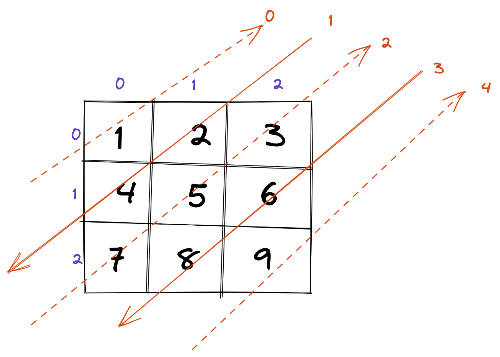

# [498. 对角线遍历](https://leetcode.cn/problems/diagonal-traverse)

## 题目描述

<!-- 这里写题目描述 -->

给你一个大小为 <code>m x n</code> 的矩阵 <code>mat</code> ，请以对角线遍历的顺序，用一个数组返回这个矩阵中的所有元素。

&nbsp;

<strong>示例 1：</strong>

<pre>
<strong>输入：</strong>mat = [[1,2,3],[4,5,6],[7,8,9]]
<strong>输出：</strong>[1,2,4,7,5,3,6,8,9]
</pre>

<strong>示例 2：</strong>

<pre>
<strong>输入：</strong>mat = [[1,2],[3,4]]
<strong>输出：</strong>[1,2,3,4]
</pre>

&nbsp;

<strong>提示：</strong>

<ul>
	<li><code>m == mat.length</code></li>
	<li><code>n == mat[i].length</code></li>
	<li><code>1 &lt;= m, n &lt;= 104</code></li>
	<li><code>1 &lt;= m * n &lt;= 104</code></li>
	<li><code>-105 &lt;= mat[i][j] &lt;= 105</code></li>
</ul>

## 解法

<!-- 这里可写通用的实现逻辑 -->

### 解法一

1. 先得出遍历的次数，也就是对角线的条数为i=n+m-1，所以数组遍历条件也就是i<n+m-1。
2. 在看图，对角线上的每个元素坐标之和为i,也就是元素的坐标xy与i的关系为：x+y=i
3. 如何遍历？看图中，偶数对应的对角线上的元素是从下往上遍历，而奇数对应的对角线上的元素是从上往下遍历，那么只要确定遍历的起始点和结束点就好啦！我们先看偶数对角线的起点和终点，因为奇数对角线和它相反，知道了偶数的，也不难得出奇数的的。

    - 当i<n-1时，起始点坐标x=i，如1的x坐标为0，i也为0,结束点的横坐标x=0
    - 当i>=n-1时，起始点坐标x=n-1,如2的x坐标为2，i也为2,结束点的纵坐标y=m-1,根据（2）中的关系式,所以得出横坐标x=i-(m-1)
    - 所以偶数对角线遍历时起始点的x的坐标为min(i,n-1)，结束点的x坐标为max(0,i-(m-1)),而坐标y就是i-x

